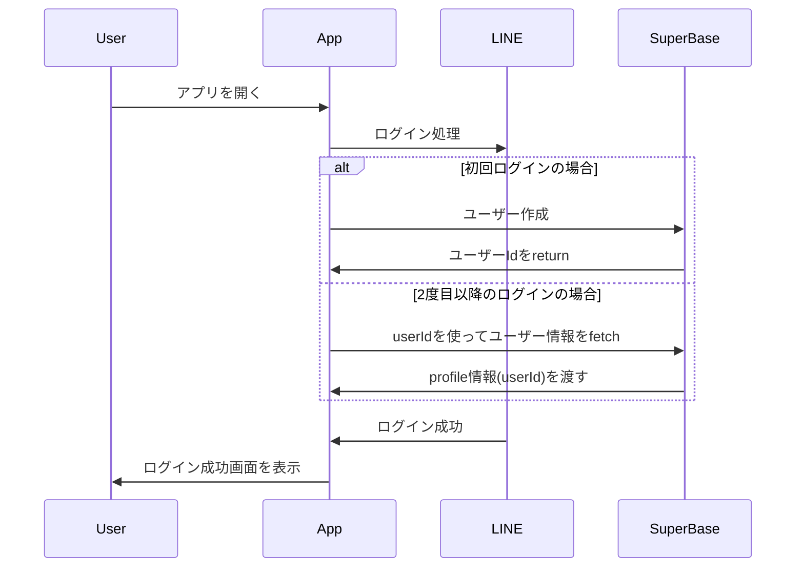
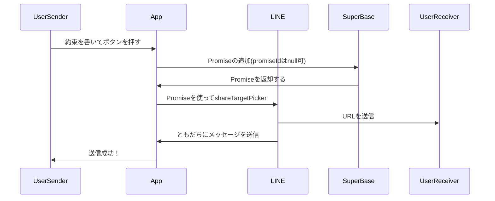
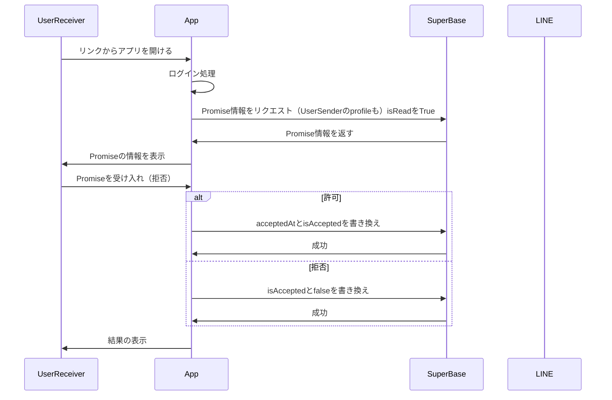

# 処理の流れ

## ユーザーの初回ログイン

```mermaid

sequenceDiagram
    participant User
    participant App
    participant LINE
    participant SuperBase
    
    User ->> App: アプリを開く
    App ->> LINE: ログイン処理
    alt 初回ログインの場合
      App ->> SuperBase: ユーザー作成
      SuperBase ->> App: ユーザーIdをreturn
    else 2度目以降のログインの場合
      App ->> SuperBase: userIdを使ってユーザー情報をfetch
      SuperBase ->> App: profile情報(userId)を渡す
    end
    LINE ->> App: ログイン成功
    App ->> User: ログイン成功画面を表示

```

## Promiseの作成

```mermaid

sequenceDiagram
    participant UserSender
    participant App
    participant LINE
    participant SuperBase
    participant UserReceiver
    
    UserSender ->> App: 約束を書いてボタンを押す
    App ->> SuperBase: Promiseの追加(promiseIdはnull可)
    SuperBase ->> App: Promiseを返却する
    App ->> LINE: Promiseを使ってshareTargetPicker
    LINE ->> UserReceiver: URLを送信
    LINE ->> App: ともだちにメッセージを送信
    App ->> UserSender: 送信成功！

```

## ReceiverがPromiseにアクセス

```mermaid

sequenceDiagram
    participant UserReceiver
    participant App
    participant SuperBase
    participant LINE

    UserReceiver ->> App: リンクからアプリを開ける 
    App ->> App: ログイン処理
    App ->> SuperBase: Promise情報をリクエスト（UserSenderのprofileも）isReadをTrue
    SuperBase ->> App: Promise情報を返す
    App ->> UserReceiver: Promiseの情報を表示
    UserReceiver ->> App: Promiseを受け入れ（拒否）
    alt 許可
      App ->> SuperBase: acceptedAtとisAcceptedを書き換え
      SuperBase ->> App: 成功
    else 拒否
      App ->> SuperBase: isAcceptedとfalseを書き換え
      SuperBase ->> App: 成功
    end
    App ->> UserReceiver: 結果の表示

```
